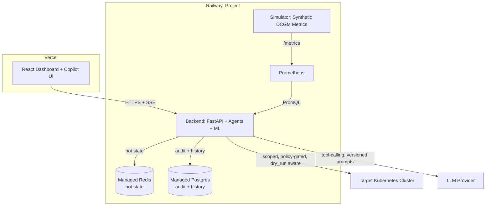
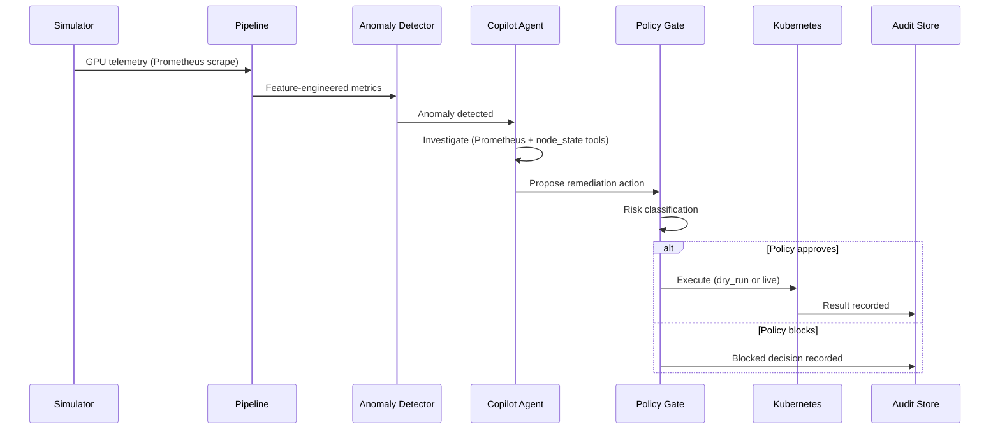

<div align="center">

# Kronvel

**Autonomous GPU cluster intelligence — with a receipt for every decision.**

> **Community Edition:** Kronvel is source-available under the **Kronvel Community License 1.0 (KCL-1.0)**. Personal, educational, and research use are permitted. Commercial use requires prior written permission.

> 🚧 **Project Status:** Kronvel is currently under active MVP development. APIs, architecture, and features may change before the first stable release.

An AI-powered, closed-loop control layer for Kubernetes-based GPU clusters: detect, reason, act, and audit — automatically.


[](LICENSE)
[](backend/)
[](frontend/)
[](backend/requirements.txt)
[](docs/ROADMAP.md)
[](CONTRIBUTING.md)

[Overview](#project-overview) • [Architecture](#system-architecture-overview) • [Getting Started](#getting-started) • [Roadmap](#project-roadmap) • [Contributing](#contributing-guidelines)

</div>

---

## Table of Contents

1. [Project Overview](#project-overview)
2. [Why Kronvel Exists](#why-kronvel-exists)
3. [Problem Statement](#problem-statement)
4. [Solution](#solution)
5. [Key Features](#key-features)
6. [System Architecture Overview](#system-architecture-overview)
7. [Technology Stack](#technology-stack)
8. [Repository Structure](#repository-structure)
9. [Getting Started](#getting-started)
10. [Installation](#installation)
11. [Environment Variables](#environment-variables)
12. [Running Locally](#running-locally)
13. [Running with Docker](#running-with-docker)
14. [Deployment Architecture](#deployment-architecture)
15. [API Overview](#api-overview)
16. [AI Architecture](#ai-architecture)
17. [Project Roadmap](#project-roadmap)
18. [Current MVP Status](#current-mvp-status)
19. [Demo Screenshots](#demo-screenshots)
20. [Future Improvements](#future-improvements)
21. [Contributing Guidelines](#contributing-guidelines)
22. [License](#license)
23. [Acknowledgements](#acknowledgements)

---

## Documentation

| Document | Purpose |
|----------|---------|
| ARCHITECTURE.md | System architecture |
| ROADMAP.md | Development roadmap |
| SETUP.md | Local setup guide |
| PROJECT_DASHBOARD.md | MVP progress tracking |
| LICENSE | Licensing terms |
| CONTRIBUTING.md | Contribution guide |

## Project Overview

Kronvel is a closed-loop intelligence and control platform for Kubernetes-based NVIDIA GPU clusters. It continuously observes GPU telemetry, detects anomalies using statistical and ML-based models, reasons about root cause through a tool-calling LLM agent, and when policy allows — executes remediation directly against the cluster. Every decision the system makes, human or autonomous, is captured in a structured, queryable audit trail.

Kronvel is not a chatbot layered on top of a dashboard. It is an agentic system where the LLM has real tools — Prometheus queries, live node state, and scoped `kubectl` execution — and every action it can take is gated by an explicit risk-classification policy before it touches the cluster.

## Why Kronvel Exists

GPU clusters are expensive, failure-prone, and operationally opaque. A single overheating node, a silent ECC error, or a bad scheduling decision can waste thousands of dollars in idle or wasted compute before a human notices. Existing tooling (Grafana dashboards, static alerting rules) tells you that something is wrong — rarely why, and never what safe action to take next. Kronvel exists to close that gap: observability that reasons, and remediation that is auditable.

## Problem Statement

- GPU cluster telemetry is high-volume and hard to interpret in real time; anomalies are often caught late or missed entirely.
- Root-causing a GPU fault (thermal, XID error, ECC, memory pressure) requires correlating multiple signals — a task humans do slowly and inconsistently under alert fatigue.
- Manual remediation (cordoning nodes, rescheduling workloads, restarting processes) is slow, error-prone under pressure, and rarely logged with enough context to audit after the fact.
- Autonomous remediation is high-risk without a policy layer: an agent with unrestricted cluster access is a liability, not a feature.

## Solution

Kronvel implements a closed feedback loop:

**Collect → Detect → Reason → Decide → Act → Audit**

1. **Collect** — GPU telemetry is scraped from Prometheus (DCGM exporter format).
2. **Detect** — A feature pipeline and anomaly model flag deviations in real time.
3. **Reason** — A tool-calling LLM agent investigates using live Prometheus queries and node state — not hallucinated context.
4. **Decide** — A policy engine risk-classifies any proposed action before execution.
5. **Act** — Approved actions execute against Kubernetes through a scoped, allowlisted `kubectl` tool, gated by a `dry_run` default.
6. **Audit** — Every decision, human or agent, is written as an immutable, queryable record.

## Key Features

| Feature | Description |
|---|---|
| **Real-time anomaly detection** | Statistical and ML-based detection over live GPU telemetry (thermal, XID, ECC, memory, utilization). |
| **Tool-calling AI Copilot** | A ReAct-style agent that investigates cluster state using real tools, not prompt-only reasoning — streamed to the UI over SSE. |
| **Policy-gated remediation** | Every proposed action is risk-scored and gated behind an explicit policy decision before execution. |
| **Dry-run by default** | All remediation actions default to simulated execution unless explicitly cleared by policy. |
| **Full audit trail** | Every action — proposed, approved, blocked, or executed — is recorded as a structured, queryable domain object. |
| **Intelligent scheduling signals** | Node scoring for placement decisions based on live cluster health. |
| **Synthetic GPU telemetry simulator** | Realistic, fault-injectable DCGM-format metrics for development and demo without needing physical GPU hardware. |
| **Production-aligned architecture** | Independently deployable services, managed state stores, and a structure designed to migrate cleanly onto Kubernetes. |

## System Architecture Overview



### Closed-Loop Decision Flow



## Technology Stack

| Layer | Technology |
|---|---|
| Frontend | React, Vite, TypeScript |
| Backend API | FastAPI (Python 3.11) |
| AI Agents | LLM tool-calling (ReAct pattern), versioned prompt templates |
| ML | Statistical + trainable anomaly detection, heuristic scheduler scoring |
| Metrics | Prometheus, DCGM exposition format |
| Hot state | Redis (Railway Managed) |
| Durable state | PostgreSQL (Railway Managed) |
| Cluster integration | Kubernetes API via scoped ServiceAccount |
| Containerization | Docker, Docker Compose |
| Frontend hosting | Vercel |
| Backend hosting | Railway |

## Repository Structure

```
kronvel/
├── backend/         # FastAPI + AI agents + ML — Railway Service #1
├── simulator/        # Synthetic GPU telemetry — Railway Service #2
├── frontend/         # React + Vite dashboard — Vercel
├── infra/            # Prometheus config + Docker Compose (local/demo)
├── deploy/           # Reserved for future Kubernetes manifests/Helm
├── shared/           # Cross-service schemas, constants, utilities
├── scripts/          # Repo-wide setup, deploy, demo, codegen scripts
└── docs/             # Architecture, roadmap, setup, development docs
```

See [`docs/ARCHITECTURE.md`](docs/ARCHITECTURE.md) for the full annotated structure.

## Getting Started

**Prerequisites:** Docker & Docker Compose, Python 3.11+, Node.js 18+, `make`.

```bash
git clone https://github.com/kaziakil/kronvel.git
cd kronvel
cp .env.example .env
make dev
```

This brings up the full local stack — backend, simulator, Prometheus, Redis, Postgres, and frontend — via Docker Compose. See [`docs/SETUP.md`](docs/SETUP.md) for a complete walkthrough.

## Installation

```bash
# Backend
cd backend
python -m venv venv && source venv/bin/activate
pip install -r requirements.txt

# Frontend
cd ../frontend
npm install

# Simulator
cd ../simulator
python -m venv venv && source venv/bin/activate
pip install -r requirements.txt
```

## Environment Variables

| Variable | Service | Description |
|---|---|---|
| `DATABASE_URL` | backend | PostgreSQL connection string |
| `REDIS_URL` | backend | Redis connection string |
| `PROMETHEUS_URL` | backend | Prometheus query endpoint |
| `ANTHROPIC_API_KEY` | backend | LLM provider API key |
| `DRY_RUN_DEFAULT` | backend | Default remediation execution mode (`true` recommended) |
| `KUBE_CONFIG` / in-cluster SA token | backend | Kubernetes API credentials, scoped ServiceAccount |
| `SIM_SCENARIO` | simulator | Active fault-injection scenario |
| `SIM_NODE_COUNT` | simulator | Number of simulated GPU nodes |
| `VITE_API_BASE_URL` | frontend | Backend API base URL |

Full reference and defaults: see each service's `.env.example`.

## Running Locally

```bash
make dev        # full stack via Docker Compose
make test        # run backend + frontend test suites
make demo        # run the scripted demo scenario end-to-end
```

## Running with Docker

```bash
# Full local development stack
docker compose -f infra/docker-compose.yml up --build

# Demo stack (seeded data, faster polling interval)
docker compose -f infra/docker-compose.demo.yml up --build
```

## Deployment Architecture

| Component | Target | Notes |
|---|---|---|
| Frontend | Vercel | Static build + edge |
| Backend | Railway | FastAPI service, single replica (see [`docs/ARCHITECTURE.md`](docs/ARCHITECTURE.md) for scaling notes) |
| Simulator | Railway | Independent service, no external dependencies |
| Prometheus | Railway | Scrapes simulator, queried by backend |
| Redis | Railway Managed Add-on | Hot state |
| PostgreSQL | Railway Managed Add-on | Audit trail + history |

Full deployment mapping and diagrams: [`docs/ARCHITECTURE.md`](docs/ARCHITECTURE.md).

## API Overview

| Endpoint | Method | Description |
|---|---|---|
| `/health` | GET | Liveness/readiness checks |
| `/anomalies` | GET | List detected anomalies |
| `/nodes` | GET | Live node/cluster state |
| `/scheduler/score` | GET | Node placement scoring |
| `/copilot/chat` | POST (SSE) | Streamed agent conversation |
| `/remediation/execute` | POST | Trigger a policy-gated remediation action |
| `/remediation/history` | GET | Query the audit trail |

Full API reference: [`docs/api.md`](docs/api.md) *(generated from OpenAPI schema).*

## AI Architecture

Kronvel's Copilot is a **tool-calling agent**, not a prompt-only chatbot. It operates in a ReAct loop with access to:

- `prometheus.py` — read-only metric queries
- `node_state.py` — read-only cluster inventory
- `kubectl.py` — write-capable, scoped ServiceAccount, allowlisted verbs only
- `alert.py` — notification side-effects

All prompts are versioned artifacts (`backend/app/prompts/`), not inline strings — every agent decision can be traced to an exact prompt version in the audit record. Every proposed action passes through `agents/policy.py` for risk classification before it can reach the `kubectl` tool, and execution defaults to `dry_run=true` unless explicitly cleared. See [`docs/ARCHITECTURE.md`](docs/ARCHITECTURE.md) for the full agent design.

## Project Roadmap

See [`docs/ROADMAP.md`](docs/ROADMAP.md) for the full day-by-day MVP plan and post-MVP direction.

## Current MVP Status

> 🚧 **Kronvel is in active MVP development.** Live progress tracking: [`PROJECT_DASHBOARD.md`](PROJECT_DASHBOARD.md).

| Area | Status |
|---|---|
| Simulator | 🔴 Not started |
| Backend core + repositories | 🔴 Not started |
| Anomaly detection pipeline | 🔴 Not started |
| Dashboard UI | 🔴 Not started |
| Copilot agent | 🔴 Not started |
| Remediation + audit trail | 🔴 Not started |
| Deployment | 🔴 Not started |

## Demo Screenshots

> *Screenshots will be added here as the MVP dashboard and Copilot UI are built.*

| Dashboard | Copilot Chat | Audit Trail |
|---|---|---|
| _placeholder_ | _placeholder_ | _placeholder_ |

## Future Improvements

- Trained ML anomaly model with model registry and versioning (`docs/ROADMAP.md` — post-MVP)
- Kubernetes-native deployment of Kronvel itself (`deploy/k8s`, Helm charts)
- Multi-cluster and multi-tenant support
- Horizontal scaling of the collection pipeline (queue-based worker architecture)
- Automated drift detection and retraining pipeline
- Fine-grained RBAC beyond a single scoped ServiceAccount

## Contributing Guidelines

Contributions are welcome. Please read [`CONTRIBUTING.md`](CONTRIBUTING.md) before opening a PR, and check [`PROJECT_DASHBOARD.md`](PROJECT_DASHBOARD.md) for current priorities.

By submitting a contribution to Kronvel, you agree that your contribution will be licensed under the Kronvel Community License 1.0 (KCL-1.0) as described in the LICENSE file.

## License

Kronvel is distributed under the **Kronvel Community License 1.0 (KCL-1.0)**.

### What you may do

- ✅ View and study the source code.
- ✅ Use Kronvel for personal, educational, academic, evaluation, and research purposes.
- ✅ Fork the repository for non-commercial purposes.
- ✅ Submit pull requests, bug fixes, and feature contributions.

### Commercial Use

Commercial use—including selling Kronvel, offering it as a hosted service (SaaS/PaaS), integrating it into commercial products, or using it for commercial advantage—requires prior written permission from the Licensor.

For commercial licensing or partnership inquiries:

**Kazi Akil Ahmed**

📧 kaziakilahmed@gmail.com

See the full [LICENSE](LICENSE) for complete terms and conditions.

## Disclaimer

Kronvel is experimental software under active development and is not recommended for production environments without thorough testing and security review.

## Acknowledgements

Built with FastAPI, React, Prometheus, and the broader Kubernetes ecosystem. Developed as an MVP for AI infrastructure hackathon submission.

**Project Partner:** Md Mehrab Hossen  
**Email:** mehrabhossen0001@gmail.com

---

© 2026 Kazi Akil Ahmed. All rights reserved.

"Kronvel" and its associated branding are the intellectual property of Kazi Akil Ahmed unless otherwise stated.
