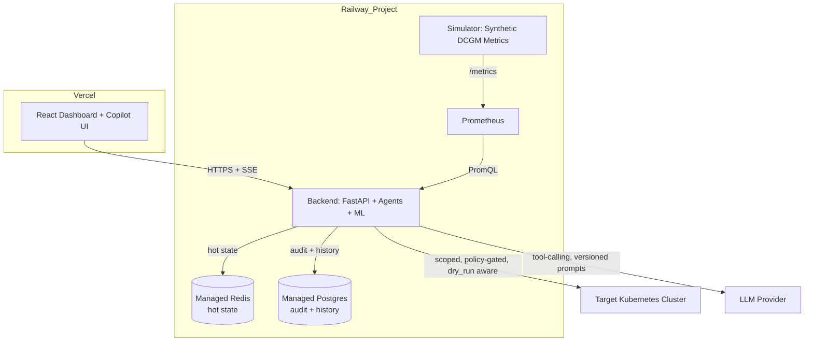
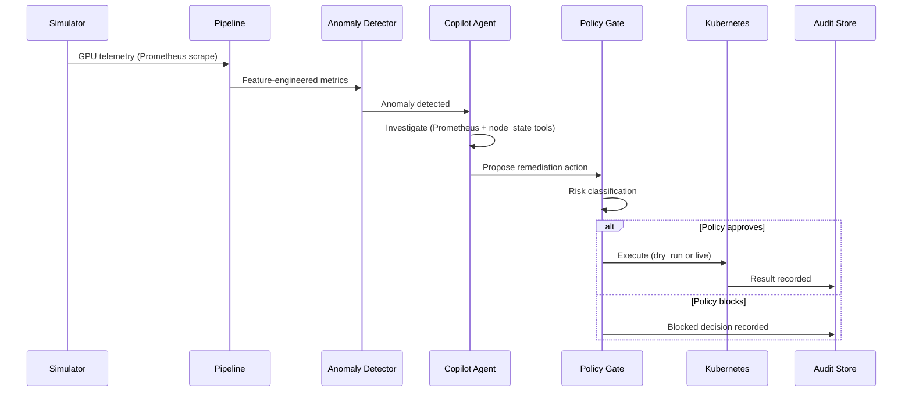

# Kronvel — Architecture

## System Overview



## Closed-Loop Decision Flow



## Repository Structure (Annotated)

```
kronvel/
│
├── backend/                          # Railway Service #1
│   ├── app/
│   │   ├── api/routes/                # Thin controllers — parse request, call services/, return response
│   │   ├── core/                      # Backend-internal cross-cutting only: config, exceptions, logging, security
│   │   ├── services/                  # Orchestration layer — all business logic lives here
│   │   ├── agents/                    # LLM agent, tools, policy
│   │   │   └── tools/                 # prometheus, kubectl, node_state, alert — independently testable
│   │   ├── prompts/                   # Versioned prompt templates, not inline strings
│   │   ├── ml/                        # anomaly detection + scheduler scoring
│   │   ├── pipeline/                  # collector → processor → worker (APScheduler, single replica)
│   │   ├── repositories/              # Interface (base.py) + Redis/Postgres implementations
│   │   ├── models/                    # Domain/Pydantic models, incl. action_audit.py
│   │   └── main.py
│   ├── tests/
│   └── scripts/
│
├── simulator/                         # Railway Service #2 — synthetic GPU telemetry
├── frontend/                          # Vercel — React + Vite dashboard
├── infra/                             # What we run today: docker-compose, Prometheus config
├── deploy/                            # Reserved for future k8s manifests/Helm — empty for MVP
├── shared/                            # Cross-SERVICE contracts: schemas, constants, utils
├── scripts/                           # Repo-wide setup/deploy/demo/codegen
└── docs/                              # This directory
```

## Architectural Principles

### `core/` vs `shared/` boundary
`shared/` holds anything importable by both `backend/` and `simulator/` — pure data contracts and logic with zero backend-specific dependencies. `core/` holds backend-internal cross-cutting concerns (config, auth, logging) that depend on FastAPI or backend-only infrastructure. This boundary is enforced in code review.

### `services/` as the orchestration layer
Routes never call `agents/`, `ml/`, or `repositories/` directly. Business logic lives in `services/`, making it testable without spinning up FastAPI and giving a single place to enforce cross-cutting rules like the `dry_run` gate and audit logging.

### `repositories/` as a real Repository pattern
`services/remediation_service.py` depends on the `AuditRepository` interface (`repositories/base.py`), never directly on `postgres_repository.py`. This allows swapping backends without touching service logic and allows unit-testing services against in-memory fakes.

### Prompts as versioned artifacts
Every LLM prompt lives in `prompts/` as a named, versioned template loaded via `prompts/registry.py`. Every agent decision recorded in the audit trail includes the exact prompt version used — critical for debugging and for the trust narrative around autonomous decisions.

### Policy gate + dry_run as non-negotiable defaults
`agents/policy.py` risk-classifies every proposed action before it can reach `agents/tools/kubectl.py`. `DRY_RUN_DEFAULT=true` in all environments except an explicitly configured live demo/production context. This is the primary answer to "what stops the agent from doing something dangerous."

### Action audit as a first-class domain object
`models/action_audit.py` is not a log line — it's a structured, queryable record: input, risk score, policy decision, executor identity (agent vs. human override), outcome, and rollback reference. Written for every proposed action, approved or blocked.

## Deployment Mapping

| Repo Directory | Deployment Target | Runtime | Talks To | Key Env Vars |
|---|---|---|---|---|
| `frontend/` | Vercel | Node (build) → static + edge | Backend (HTTPS/SSE) | `VITE_API_BASE_URL` |
| `backend/` | Railway Service #1 | Python 3.11 / FastAPI / Uvicorn | Redis, Postgres, Prometheus, LLM API, K8s API | `REDIS_URL`, `DATABASE_URL`, `ANTHROPIC_API_KEY`, `PROMETHEUS_URL`, `KUBE_CONFIG`, `DRY_RUN_DEFAULT` |
| `simulator/` | Railway Service #2 | Python 3.11 | Exposes `/metrics` to Prometheus | `SIM_SCENARIO`, `SIM_NODE_COUNT` |
| `infra/prometheus/` | Railway Service #3 | Prometheus (container) | Scrapes simulator, queried by backend | `SCRAPE_INTERVAL` |
| Redis | Railway Managed Add-on | Redis 7 | Backend (hot state) | `REDIS_URL` (auto-injected) |
| Postgres | Railway Managed Add-on | Postgres 15 | Backend (durable state) | `DATABASE_URL` (auto-injected) |
| `deploy/` | Not deployed in MVP | — | — | — |

## Known Constraints & Accepted Technical Debt

- **Single-replica backend**: `pipeline/worker.py` uses in-process APScheduler. Scaling to 2+ replicas would duplicate scheduled jobs. Accepted for MVP; migration path is a queue-based worker (Celery/Redis) or a k8s CronJob — see [`ROADMAP.md`](ROADMAP.md) Phase 2.
- **SQLite is not used anywhere in this architecture.** Any durable state uses Postgres; ephemeral Railway container disks make SQLite unsafe across redeploys.
- **`deploy/` is intentionally empty for MVP.** Building Kubernetes manifests for Kronvel itself has zero demo payoff and is explicitly deferred.

## Future Migration to Kubernetes

The repository structure is designed so that migrating Kronvel's own deployment from Railway to Kubernetes requires no reorganization — only populating `deploy/k8s` and `deploy/helm` with manifests/charts that wrap the existing `backend/`, `simulator/`, and `infra/prometheus/` Dockerfiles. See [`ROADMAP.md`](ROADMAP.md) Phase 2 for sequencing.
